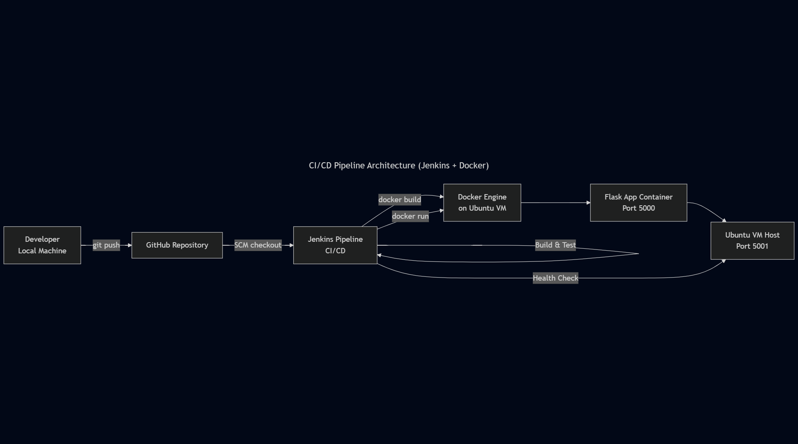

# CI/CD Pipeline with Jenkins and Docker

This project demonstrates a production-style CI/CD pipeline that builds, tests, containerizes, and deploys a Flask web application using Jenkins and Docker.

## Why This Project

As part of my DevOps and Cloud career transition, I wanted to demonstrate
practical CI/CD skills beyond theory.

This project was designed to reflect real-world constraints such as:
- Shared infrastructure
- Port conflicts
- Idempotent deployments
- Clear failure signals

## Project Structure

    ci-cd-jenkins-docker-pipeline/
    ├── app/
    │   ├── app.py
    │   ├── test_app.py
    │   └── requirements.txt
    ├── docker/
    │   └── Dockerfile
    ├── jenkins/
    │   └── Jenkinsfile
    ├── scripts/
    ├── ci-cd-architecture.png
    └── README.md

## Architecture Overview

## CI/CD Pipeline Overview

This project demonstrates a production-style CI/CD pipeline using Jenkins and Docker.

## CI/CD Pipeline Stages

### 📥 Checkout
- Jenkins pulls source code from GitHub
- Jenkinsfile path explicitly set to `jenkins/Jenkinsfile`

### 🛠️ Build
- Python virtual environment is created
- Dependencies installed from `requirements.txt`

### 🧪 Test
- Tests executed using pytest
- Pipeline fails immediately on test failure

### 🐳 Docker Build
- Image built using a lightweight Python base image
- `.dockerignore` reduces build context

### 🚀 Deploy
- Existing container is removed if present
- New container is started with explicit port mapping
- Deployment is idempotent and safe to re-run

### ❤️‍🩹 Health Check
- Jenkins sends HTTP request to `/health`
- Pipeline succeeds only if application responds correctly

## 🧠 Key Design Decisions

- Tests run before Docker build to fail fast and reduce wasted build time
- Container port (5000) mapped to host port (5001) to avoid conflicts
- Flask binds to `0.0.0.0` to allow container access
- Named containers used for predictable management
- Health checks validate application availability, not just container status

## 🚧 Challenges and Resolutions

### Jenkinsfile Not Found
- Root cause: Incorrect SCM script path
- Resolution: Explicitly set path to `jenkins/Jenkinsfile`

### Port Collision
- Root cause: Port 5000 already in use by another service
- Resolution: Mapped container port 5000 to host port 5001

### ❤️‍🩹 Health Check Failures
- Root cause: Incorrect port mapping and Flask binding
- Resolution: Corrected Docker run syntax and Flask host binding

## 🔆 Outcome

- Fully automated CI/CD pipeline running successfully
- Safe container redeployments on shared infrastructure
- Deployment verified through application-level health checks
- Pipeline produces deterministic, repeatable results

## 📝 What This Project Demonstrates

- Real-world CI/CD pipeline design
- Jenkins + Docker integration
- Idempotent deployment strategies
- Practical debugging of CI/CD failures
- Production-aware decision making

